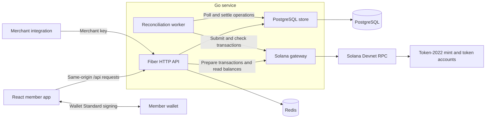
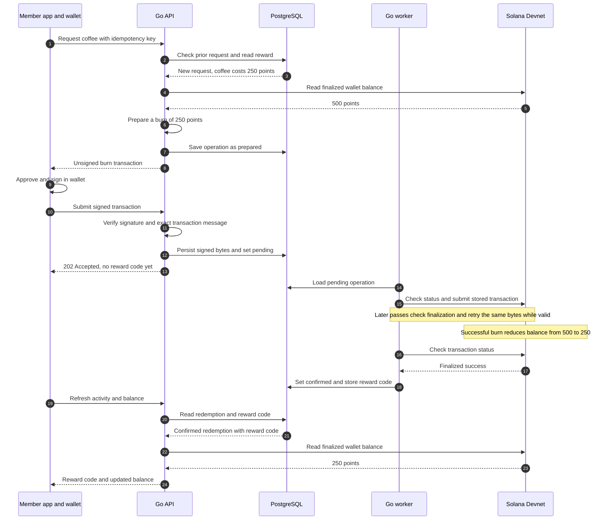

# Orbit

A Solana loyalty app with non-transferable points, wallet sign-in, rewards and redemption history.

| Directory | Stack |
| --- | --- |
| `client/` | React 19, Vite 8, Bun, TypeScript 7.0.2, StyleX 0.19 |
| `server/` | Go 1.27, Fiber 3, pgx, go-redis, Solana Go SDK |
| `tools/` | Bun and the official Metaplex SDK for Devnet token metadata |
| `compose.yaml` | PostgreSQL 18 and Redis 8, bound to localhost |

**Go is suitable for this backend. C is not required.** The backend calls Solana RPC and the existing Token-2022 program. Its `NonTransferable` extension keeps points in the member’s wallet. Custom on-chain business rules would require a separate Solana program, normally written in Rust. See [Solana’s non-transferable token documentation](https://solana.com/docs/tokens/extensions/non-transferrable-tokens) and the [Solana Go SDK](https://github.com/solana-foundation/solana-go).

## Architecture

Orbit is a React single-page app backed by one Go service. The service runs the Fiber HTTP API and a reconciliation worker in the same process. PostgreSQL holds the durable operation journal; the worker polls it to submit transactions and settle their results. Solana Devnet executes minting and burning through the existing Token-2022 program.



During development, Vite serves the client on port 5173 and proxies `/api` to port 8080. Compose runs PostgreSQL and Redis; the client and Go service run separately on the host. A hosted deployment needs a same-origin reverse proxy for the client and API.

### Code map

| Module | Responsibility |
| --- | --- |
| [`client/src/App.tsx`](client/src/App.tsx), [`views.tsx`](client/src/views.tsx), [`ui.tsx`](client/src/ui.tsx) | Navigation, member views, dialogs and shared StyleX components. |
| [`client/src/useOrbit.ts`](client/src/useOrbit.ts) | Guest/demo/member state, session restoration, balance and activity polling, and redemption orchestration. |
| [`client/src/redemptions.ts`](client/src/redemptions.ts) | Persists redemption retry keys with operation IDs, recovers pending attempts, and clears matching terminal attempts. |
| [`client/src/api.ts`](client/src/api.ts), [`wallet.ts`](client/src/wallet.ts), [`domain.ts`](client/src/domain.ts) | Same-origin HTTP requests, Wallet Standard discovery/signing, shared types, point formatting and demo logic. |
| [`server/cmd/api/main.go`](server/cmd/api/main.go) | Loads configuration, initializes storage, validates the configured chain/mint, and starts the API and worker. |
| [`server/internal/api/`](server/internal/api/) | Routes, session and merchant authentication, origin checks, rate limits, and background reconciliation in `worker.go`. |
| [`server/internal/store/`](server/internal/store/) | Embedded schema and seed data, reward queries, idempotent operations, settlement and reward collection. |
| [`server/internal/chain/`](server/internal/chain/) | Devnet/mint validation, finalized balance reads, transaction construction, signature verification, submission and status checks through the `Gateway` interface. |
| [`server/internal/config/`](server/internal/config/), [`server/cmd/setup/`](server/cmd/setup/) | Environment validation and a separate CLI for authority key generation and Devnet mint creation. |

### Data ownership

| Location | Data and role |
| --- | --- |
| Solana | Authoritative point balances in members’ associated token accounts and transaction outcomes. The mint uses zero-decimal, non-transferable tokens. |
| PostgreSQL | `rewards` stores the catalog. `operations` stores earn/redeem requests, idempotency keys, transaction bytes, signatures, statuses, claim codes and collection timestamps. `app_settings` binds the database to one mint. |
| Redis | Single-use sign-in challenges (5 minutes), hashed session-token keys mapped to wallets (24 hours), write rate-limit counters (60 seconds), and the reward catalog cache (30 seconds). |
| Browser | React holds UI and demo state. Local storage retains redemption idempotency keys and operation IDs across retries; the session token is an HttpOnly cookie. Member private keys remain in the wallet. |

The backend holds the merchant’s mint-authority keypair and pays issuance/account-creation fees. Members sign and pay for their own burns. Reward definitions and claim fulfillment are handled off-chain by the API and PostgreSQL.

### How Solana and PostgreSQL work together

**Solana holds the actual loyalty points. PostgreSQL holds the business records.** The Go API and worker connect them; there is no direct database-to-blockchain connection or shared transaction.

| Action | Solana | PostgreSQL |
| --- | --- | --- |
| Earn points | Mints points into the member’s token account. | Records the purchase reference, idempotency key and operation outcome. |
| Redeem a reward | Burns points authorized by the member’s wallet; enforces sufficient balance. | Supplies the reward cost, tracks the redemption and stores its claim code after finalization. |
| Collect the reward | No additional chain transaction. | Records collection once using `fulfilled_at`. |

For example, a member with **500 points** redeems a **250-point coffee**. This diagram shows the successful path; the API’s chain calls go through the Solana gateway shown above.



Activity and balance are separate API requests, grouped in the diagram for readability. At collection, the merchant sends the reward code to the API, which atomically records `fulfilled_at` in PostgreSQL. Collecting the coffee does not burn points again.

Solana provides wallet-controlled points and independently verifiable transaction history. The app still manages the catalog, codes and fulfillment. Because the two systems settle asynchronously, a successful burn may briefly precede its reward code; the worker records the finalized result on a later pass. Failed or expired operations receive no code, and RPC errors leave the outcome unresolved for retry.

### Main flows

1. **Sign in:** the API stores a challenge in Redis; the wallet signs its message. The API consumes the challenge, verifies the Ed25519 signature and creates a session cookie. Sign-in does not submit a chain transaction.
2. **Earn points:** the merchant sends a purchase reference, wallet, points and UUID idempotency key. The API prepares and authority-signs a transaction that creates the associated token account if needed and mints points. It persists the signed bytes as `pending` and returns `202`; the worker handles submission.
3. **Redeem:** the API checks the active reward and finalized balance, then stores a `prepared` transaction with explicit compute-budget instructions, the point burn and a unique operation memo. The member wallet signs it. The API verifies the exact stored message and signature, persists the signed transaction as `pending`, and returns `202`. The worker submits it and creates a claim code only after successful finalization.
4. **Collect:** the merchant submits the claim code. A conditional PostgreSQL update records `fulfilled_at` once; repeated or invalid collection attempts return `409`.

The worker runs every 3 seconds and reads up to 100 unsettled operations per pass. It checks chain status, resends the same signed bytes while pending, and persists terminal outcomes. RPC errors leave operations unsettled for a later retry. The visible member app refreshes balance and activity every 6 seconds; demo redemption uses only local React state.

The client loads balance and activity independently and shares an in-flight refresh across polling and user actions. Reward codes remain accessible while the balance RPC is slow or unavailable. A failed balance read displays **Unavailable** and disables redemption until a fresh balance arrives. Pending redemptions retain their retry key across reloads; confirmed, failed and expired attempts allow a new request with a new key.

| Operation status | Meaning |
| --- | --- |
| `prepared` | Redemption is waiting for the member’s signed transaction. |
| `pending` | Signed bytes are stored; submission or finalization is outstanding. Earn operations start here. |
| `confirmed` | The transaction succeeded at Solana’s **finalized** commitment. Redemptions receive a claim code. |
| `failed` | The transaction finalized with an on-chain error. |
| `expired` | The validity window passed without a known transaction status. An unsigned prepared redemption can also expire. |

The application status `confirmed` means finalized success; Solana’s intermediate `confirmed` status remains `pending` in Orbit. Collection sets `fulfilled_at` without changing the operation status. PostgreSQL and Solana settle asynchronously, so the operation journal and worker bridge the interval between an accepted API request and a finalized chain result.

## Run locally

Requires Bun 1.4+, Node 24+, Go 1.27.1+, and Docker Compose. Bun manages client dependencies and scripts. Vite’s development server uses Node; the production build also works with Bun.

```sh
make install
make infra
cp server/.env.example server/.env
```

In separate terminals, from the repository root:

```sh
make server
```

```sh
make dev
```

Open **http://localhost:5173**. Use this hostname to match `APP_ORIGIN`. Vite proxies `/api` to the Go server on port 8080.

Choose **Explore the demo** to try earning history, reward filters, redemption and reward codes without a wallet. Demo data is stored only in React state and resets on reload. Demo claims cannot be used with the merchant API.

With the sample environment, the catalog, wallet sign-in, PostgreSQL and Redis work. Real points operations remain disabled until you configure a funded Devnet mint. The API does not invent a balance when RPC is unavailable.

## Create a Devnet loyalty mint

The app verifies the Devnet genesis hash and refuses other networks. These commands create local key files; only `-create-mint` submits a transaction.

```sh
cd server
go run ./cmd/setup
```

Fund the printed authority address using the [Solana Devnet faucet](https://faucet.solana.com/). Then:

```sh
go run ./cmd/setup -create-mint
```

The setup command creates a zero-decimal Token-2022 mint with only the non-transferable extension and no freeze authority. It waits for finalization. Keep the generated mint keypair if retrying; the command checks the same mint address before creating anything.

Set these values in `server/.env` and restart the API:

```dotenv
SOLANA_MINT=<printed mint address>
SOLANA_AUTHORITY_KEYPAIR=../.local/authority.json
MERCHANT_API_KEY=<a random secret of at least 32 characters>
```

Use `openssl rand -hex 32` to generate the merchant secret. `.env` and `.local/` are ignored by Git. The authority pays for issuance and account creation. Members need a little Devnet SOL to redeem points. Wallet Standard wallets must support Devnet, message signing and legacy transaction signing; wallets that rewrite the prepared transaction are rejected.

Prepared redemptions include a compute-unit limit of 200,000 and a price of 1,000 micro-lamports, capping the priority fee at 200 lamports. This avoids the fee-instruction insertion observed with Phantom while retaining exact-message validation. Price dashes in Phantom do not mean the token balance is empty; these Devnet points have no market price.

### Token display metadata

The public token identity is **Orbit Points (ORBIT)**. Its [metadata JSON](client/public/token/metadata.json) and [PNG logo](client/public/token/orbit-points.png) are hosted in this public repository. Phantom fetches these assets independently of the app and PostgreSQL. Metadata was attached to the existing Devnet mint on 18 September 2026; [verification evidence](docs/verification.md#public-repository-and-token-metadata--18-september-2026) records the finalized transaction and successful Phantom name, symbol, logo and balance display.

After creating a mint, use the metadata command with `server/.env` configured. It attaches a separate Metaplex metadata account to the existing Token-2022 mint; it does not create another mint or award points.

```sh
# Validate public assets, verify the Devnet mint and authority, then simulate.
bun run metadata --uri https://raw.githubusercontent.com/hbinduni/solana-loyalty-points/main/client/public/token/metadata.json

# Publish, wait for finalization and read back both metadata and mint data.
bun run metadata --uri https://raw.githubusercontent.com/hbinduni/solana-loyalty-points/main/client/public/token/metadata.json --apply
```

The command checks that simulation leaves mint data unchanged and retains the mint authority as metadata update authority. Matching metadata is a no-op; updates preserve unrelated metadata fields. A signed recovery record is written under ignored `.local/` before submission. If submission or confirmation is interrupted, inspect its signature on Devnet before retrying. An Unknown Token label may persist until Phantom refreshes its metadata.

PostgreSQL binds to the configured mint on first startup. A different mint requires a separate database so histories cannot be mixed. Keep the authority keypair private and backed up; it controls minting.

## Issue points and collect rewards

There is no public “give me points” endpoint. Your merchant integration calls the authenticated API after a qualifying purchase. Use the same UUID `Idempotency-Key` for every retry of a purchase. Reusing it with a different payload returns `409`.

```sh
curl -X POST http://localhost:8080/api/merchant/points \
  -H 'Content-Type: application/json' \
  -H "X-Merchant-Key: $MERCHANT_API_KEY" \
  -H "Idempotency-Key: $PURCHASE_UUID" \
  -d '{"wallet":"<member public key>","points":500,"reference":"Receipt 1001"}'
```

The response is `202` with a pending operation ID. Poll its status:

```sh
curl "http://localhost:8080/api/merchant/operations/$OPERATION_ID?wallet=$MEMBER_WALLET" \
  -H "X-Merchant-Key: $MERCHANT_API_KEY"
```

Members choose a reward and sign its burn transaction. A reward code appears in Activity only after finalization. Once the merchant is ready to hand over the reward:

```sh
curl -X POST "http://localhost:8080/api/merchant/claims/$CLAIM_CODE/fulfill" \
  -H "X-Merchant-Key: $MERCHANT_API_KEY"
```

Collection is atomic. A second collection attempt returns `409`. Physical inventory, purchase validation, refunds and delivery are merchant responsibilities in this version. The seeded coffee, discount and tote rewards are starter catalog entries, not offers from an actual merchant.

## API

| Method | Path | Authentication |
| --- | --- | --- |
| GET | `/api/health` | Public; checks PostgreSQL/Redis and reports whether chain is configured |
| GET | `/api/config`, `/api/rewards` | Public |
| POST | `/api/auth/challenge`, `/api/auth/verify`, `/api/auth/logout` | Same-origin browser requests |
| GET | `/api/member/me`, `/api/member/balance`, `/api/member/activity` | Session cookie |
| POST | `/api/member/redemptions` | Session + UUID idempotency key |
| GET | `/api/member/operations/:id` | Owning member |
| POST | `/api/member/operations/:id/submit` | Owning member + exact signed transaction |
| POST | `/api/merchant/points` | Merchant key + UUID idempotency key |
| GET | `/api/merchant/operations/:id?wallet=...` | Merchant key |
| POST | `/api/merchant/claims/:code/fulfill` | Merchant key |

Balances are decimal strings to preserve `uint64` precision in JavaScript. Activity returns the latest 100 operations. Browser writes require the configured `Origin`. Use a same-origin reverse proxy for a hosted client/API; cross-origin deployment is not configured.

## Transaction guarantees

- Wallet sign-in uses an expiring, single-use Ed25519 challenge. Redis holds hashed opaque sessions; the browser receives an HttpOnly, SameSite=Strict cookie, marked Secure for HTTPS origins.
- Rewards are cached for 30 seconds. Balances are read from finalized Solana state and never authorized from Redis.
- Signed transactions are persisted before broadcasting. The background worker retries the same bytes. A timeout does not become a failed or successful award.
- The server verifies that signed redemption messages exactly match the stored burn, wallet, mint, amount and unique operation memo.
- Only finalized successful transactions produce reward codes. Confirmed or processed transactions remain pending. On-chain checks prevent overspending across concurrent burns.
- Terminal operations retain their idempotency key. Failed or expired actions require an explicit new request. Use a reliable RPC provider with transaction-history access for recovery after long outages.
- Reward collection and worker settlement use conditional database updates to prevent duplicate collection and stale-worker state changes.

## Checks

```sh
make check-all
make integration
```

`check-all` runs TypeScript, Biome, Bun domain and React hook tests, the production Vite build, Go formatting verification, vet, race tests and compilation. Hook tests use a DOM environment with real React rendering and controlled HTTP/wallet responses to exercise retry recovery, partial outages and session expiry. `integration` uses the local Compose ports, creates a unique temporary PostgreSQL schema and uses Redis database 15. It tests real storage with a deterministic Solana gateway; it does not submit real chain transactions. Separate RPC tests exercise the Devnet network guard, transaction construction, signing, finalization and expiry responses.

The SDK is pinned to `solana-go v1.22.0`: v1.24.0 failed compilation with a Token-2022/confidential-proof import cycle on 2026-09-17. Remove this pin when a newer stable version passes the chain tests; this compatibility constraint is tracked here.

StyleX uses the [official Vite plugin](https://stylexjs.com/docs/learn/installation/vite/) with the reset layer declared before its atomic styles. Component styles use explicit border and background properties.

## Current scope

This is a locally runnable, single-merchant Devnet application. It includes a member UI and merchant API, not a merchant management UI or mainnet release. Live mint creation, issuance, two redemptions and one-time collection were verified on Devnet on 18 September 2026 using a local test wallet; [verification details and transaction evidence](docs/verification.md#live-devnet-evidence) are recorded in `docs/`. Separate [real Phantom acceptance](docs/wallet-acceptance.md) verified login/cancellation, two finalized burns, pending reload recovery, distinct claims, collection and the zero-balance UI. Account switching was skipped at the user's request. Solflare, mainnet and production deployment remain untested.
